

# Full-time Debugger, Part-time Developer

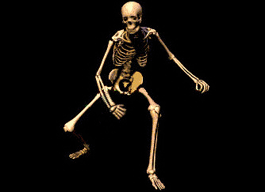

 

<table align="center" border="0" cellspacing="0" cellpadding="8">
  <tr>
    <td align="center" valign="top" width="190">
      
        
      
       
      <strong>local cryptid status</strong>
       
      online, allegedly
        
      
      
        
      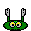
      
        
      
       
      <small>last updated whenever the fog approves</small>
    </td>
    <td valign="top" width="560">
      

        
      

       
      Hi, I'm a once-hopeful software engineering student. I scream at computers until they obey.
        
      <em>Don't know who needs to hear this, but I use <strong>Arch</strong>, btw.</em>
        
      I build tools for very specific problems, usually after accidentally creating the problem myself.
      I like systems that are practical, debuggable, and not held together by motivational quotes.
      JavaScript is still my nemesis, but I will write it, debug it, and pretend to enjoy it if the paycheck clears.
        
      I use VS Code because the last time I tried turning my terminal setup into a personality, my desktop fought back.
      Emotional stability is a feature.
    </td>
    <td align="center" valign="top" width="190">
      
        
      
       
      <strong>official wizard</strong>
       
      unlicensed, unsupervised
        
      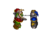
       
      <small>teamwork simulation</small>
        
      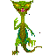
      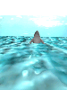
    </td>
  </tr>
</table>

  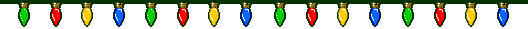

<table align="center" border="0" cellspacing="0" cellpadding="8">
  <tr>
    <td valign="top" width="380">
      <h2>Career Stuff Hidden In The Haunted Layout</h2>
      <strong>Software development</strong>
       
      Java, Android Studio, Python, Oracle SQL, MySQL, Bash, .NET
        
      <strong>DevOps</strong>
       
      Docker, Kubernetes, Jenkins
        
      <strong>Version control</strong>
       
      Git, GitHub
        
      <strong>Web development</strong>
       
      HTML, CSS, JavaScript, Django
        
      <strong>Currently learning</strong>
       
      AWS, plus whatever error message becomes today's emergency syllabus
    </td>
    <td align="center" valign="top" width="300">
      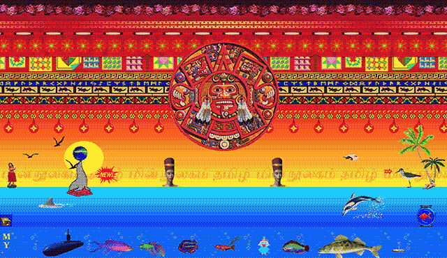
       
      <small>professional skyline, unprofessional operator</small>
        
      
    </td>
  </tr>
</table>

  

<table align="center" border="0" cellspacing="0" cellpadding="8">
  <tr>
    <td align="center" valign="top" width="760">
      <h2>Blinkie Containment Zone</h2>
      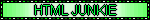
      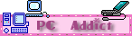
      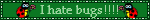
      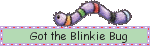
       
      
      
      
      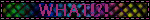
       
      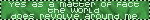
      
      
      
       
      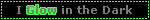
      
      
      
       
      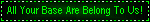
      
      
      
       
      
      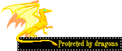
      
       
      <small>these are arranged together for historical accuracy and because blinking is a valid architectural pattern</small>
    </td>
  </tr>
</table>

  

<table align="center" border="0" cellspacing="0" cellpadding="8">
  <tr>
    <td align="center" valign="top" width="250">
      <h2>Guestbook</h2>
      
       
      
        
      
       
      <strong>sign here:</strong>
       
      <code>name: ____________</code>
       
      <code>vibe: suspicious</code>
       
      <code>browser: probably haunted</code>
    </td>
    <td valign="top" width="450">
      <h2>HR-Safe Translation</h2>
      Everything here is a joke for monetary and labor-related reasons.
      I am a motivated developer with experience delivering practical tools, debugging strange systems,
      and surviving fast-paced environments without turning every README into a corporate shrine.
        
      I can collaborate, ship, maintain, document, and talk to stakeholders without making the sprint board worse.
      I can also identify the exact moment a "quick frontend tweak" becomes a three-day archaeology project.
        
      

        
      

    </td>
  </tr>
</table>

  

<table align="center" border="0" cellspacing="0" cellpadding="8">
  <tr>
    <td align="center" valign="top" width="220">
      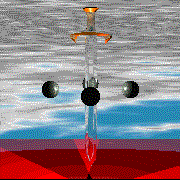
       
      <strong>current quest</strong>
       
      keep production calm
    </td>
    <td align="center" valign="top" width="220">
      
       
      <strong>known weakness</strong>
       
      CSS after midnight
    </td>
    <td align="center" valign="top" width="220">
      
       
      <strong>certification</strong>
       
      dragon approved, unverifiable
    </td>
  </tr>
</table>

  
   
  <small>best viewed in an impossible resolution, during a thunderstorm, with JavaScript disabled out of spite</small>

