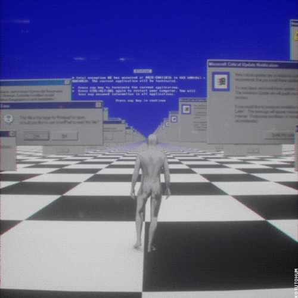

# Ground Segment Backend Developer at the European Space Agency

    

    
<table align=center>
<tr>
<th align="center">
    

    
</th>

<th align="center">
    
### Software Development:

### DevOps:

### Version Control:

### Web Development:

### Currently Learning:

    

    
</th>

</tr>
</table>
  
  
I am constantly learning and expanding my skillset to better serve the company and improve as a developer, or at least that's what I tell myself at night to sleep better. But in reality, I'm just a masochist who enjoys the pain and frustration that comes with programming. Seriously, who in their right mind would willingly choose to spend hours staring at a screen trying to debug code? But hey, at least it pays the bills, right? 

On the other hand, the dopamine rush of learning something new in JavaScript is incomparable, that is until you realize that there's a new framework that does it better. But hey, that's just the nature of the game, right? Keep up or get left behind.

    
### In summary, I may hate programming sometimes, but I love it too much to quit.
    
 

